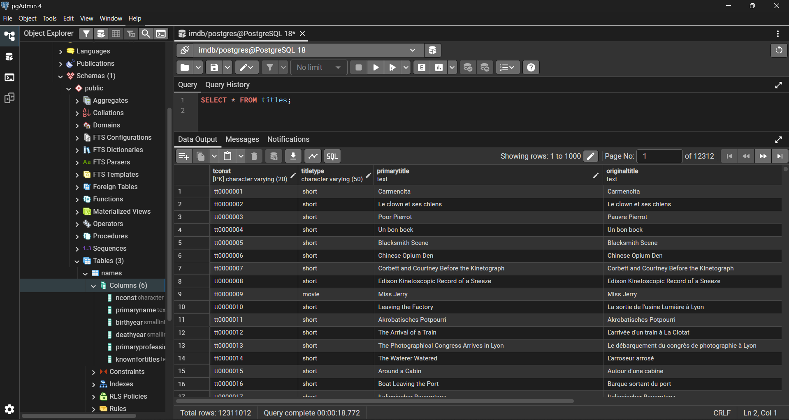
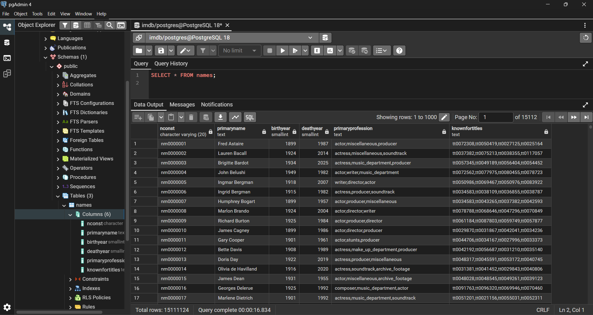
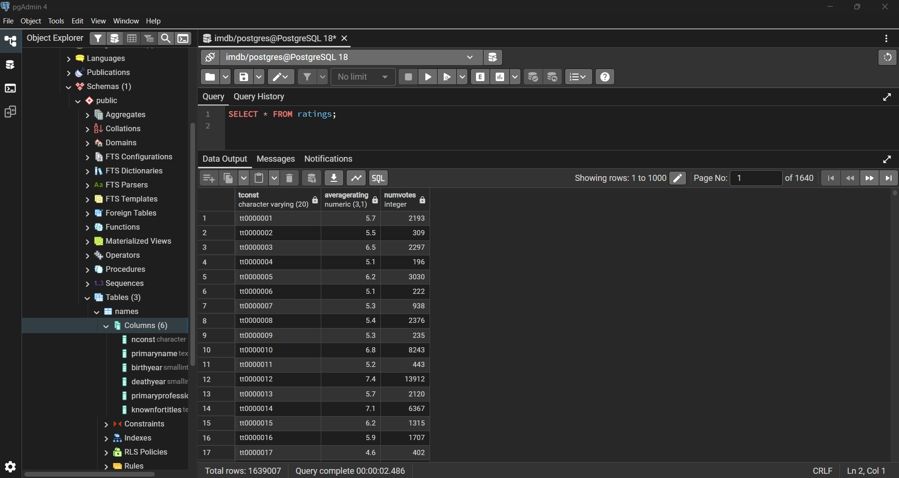
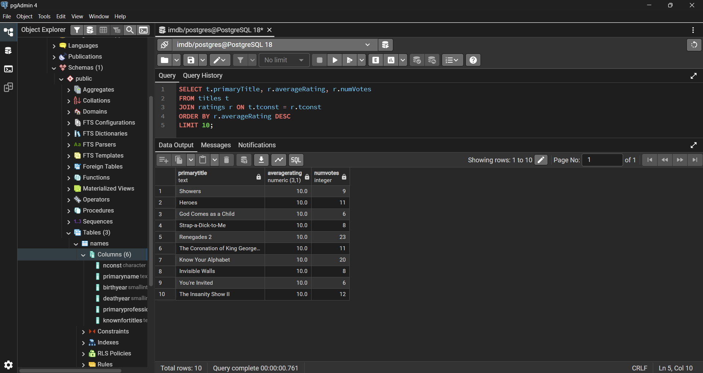
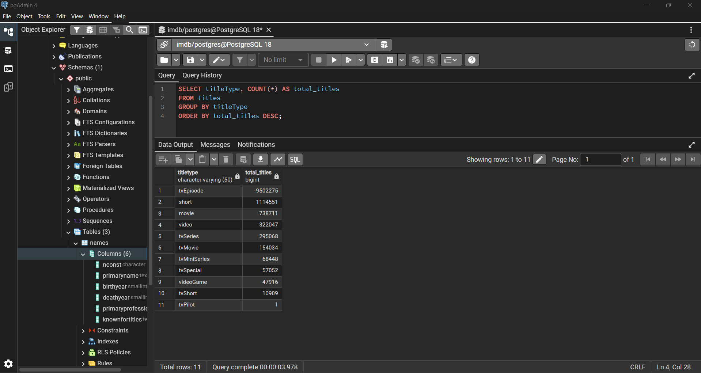
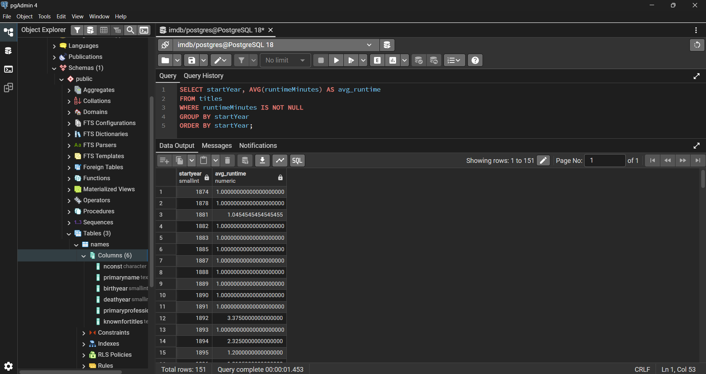

# Module 7 -- Final Project: Installing and Verifying a Large Dataset

-   Name: Womenker Karto
-   Course: Database for Analytics
-   Module: 7

---
## Overview

In this project, I located, installed, and verified a large real-world
dataset in PostgreSQL.
I used the IMDb public dataset, imported multiple tables, cleaned and
transformed the data, created relationships, and ran analytical queries
including joins and aggregations.

This project demonstrates: - Data acquisition
- Data transformation
- Schema design
- Data validation
- Analytical SQL querying

---
# 1. Initial Data Source

Dataset obtained from:

https://www.imdb.com/interfaces/
https://datasets.imdbws.com/

Files used: - title.basics.tsv.gz
- name.basics.tsv.gz
- title.ratings.tsv.gz

---
# 2. Data Format

File type: TSV (Tab-Separated Values)\
Compressed as: .gz\
Null values represented as: `\N  `{=tex} First row contains headers

  |Table Name   |Columns   |Approximate Rows
  |------------ |--------- |------------------
  |titles       |9         |10+ million
  |names        |6         |10+ million
  |ratings      |3         |1+ million

Row counts verified using SELECT COUNT(\*) after import.

---
# 3. Final Table Structures

## titles

| Column Name      | Data Type     | Key |
|------------------|--------------|-----|
| tconst           | VARCHAR(20)  | Primary Key |
| titleType        | VARCHAR(50)  | — |
| primaryTitle     | TEXT         | — |
| originalTitle    | TEXT         | — |
| isAdult          | BOOLEAN      | — |
| startYear        | SMALLINT     | — |
| endYear          | SMALLINT     | — |
| runtimeMinutes   | INTEGER      | — |
| genres           | TEXT         | — |

---

## names

| Column Name        | Data Type    | Key |
|--------------------|-------------|-----|
| nconst             | VARCHAR(20) | Primary Key |
| primaryName        | TEXT        | — |
| birthYear          | SMALLINT    | — |
| deathYear          | SMALLINT    | — |
| primaryProfession  | TEXT        | — |
| knownForTitles     | TEXT        | — |

---

## ratings

| Column Name    | Data Type     | Key |
|---------------|--------------|-----|
| tconst        | VARCHAR(20)  | Foreign Key → titles.tconst |
| averageRating | NUMERIC(3,1) | — |
| numVotes      | INTEGER      | — |

---

# 4. Data Dictionary

## titles

-   tconst -- Unique identifier for each title
-   titleType -- Type of title
-   primaryTitle -- Display title
-   originalTitle -- Original release title
-   isAdult -- Adult content indicator
-   startYear -- Release year
-   endYear -- End year for series
-   runtimeMinutes -- Duration
-   genres -- Genre categories

## names

-   nconst -- Unique identifier for person
-   primaryName -- Person name
-   birthYear -- Year of birth
-   deathYear -- Year of death
-   primaryProfession -- Main profession
-   knownForTitles -- Titles person is known for

## ratings

-   tconst -- Title identifier
-   averageRating -- IMDb rating
-   numVotes -- Number of votes

---
# 5. Obstacles Encountered

1.  Header row imported as data → fixed using HEADER true
2.  NULL values stored as `\N `{=tex}→ used NULL '`\N`{=tex}' in COPY
    command
3.  Data type conversion errors → imported as VARCHAR first, then
    altered types
4.  Foreign key constraint error → added primary key before adding
    foreign key

---
# 6. Sample Queries

## Select * from each table

```sql
SELECT * FROM titles;
```

### Screenshot



---
```sql
SELECT * FROM names;
```

### Screenshot



---
```sql
SELECT * FROM ratings;
```

### Screenshot



---

## Join Query

```sql
SELECT t.primaryTitle, r.averageRating, r.numVotes
FROM titles t
JOIN ratings r ON t.tconst = r.tconst
ORDER BY r.averageRating DESC
LIMIT 10;
```
### Screenshot



---


## Group By + Aggregate Query

```sql
SELECT titleType, COUNT(*) AS total_titles
FROM titles
GROUP BY titleType
ORDER BY total_titles DESC;
```
### Screenshot



---

## Additional Aggregate Example


```sql
SELECT startYear, AVG(runtimeMinutes) AS avg_runtime
FROM titles
WHERE runtimeMinutes IS NOT NULL
GROUP BY startYear
ORDER BY startYear;
```
### Screenshot



---
