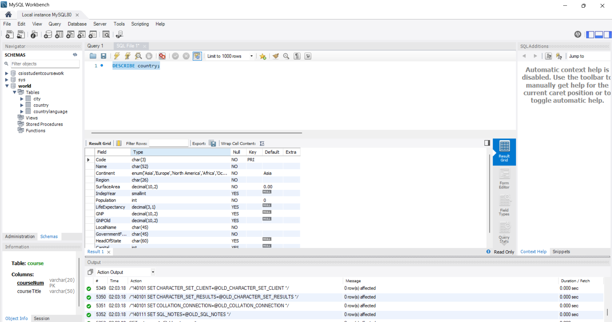
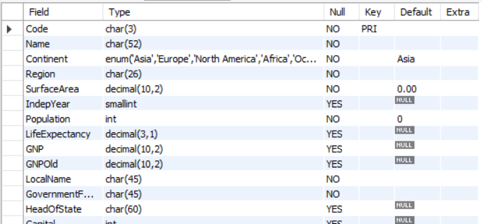
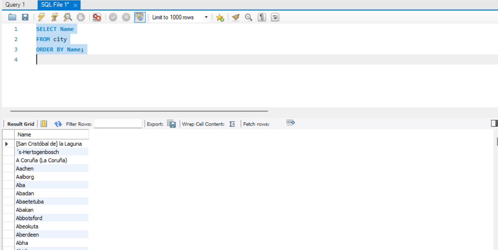
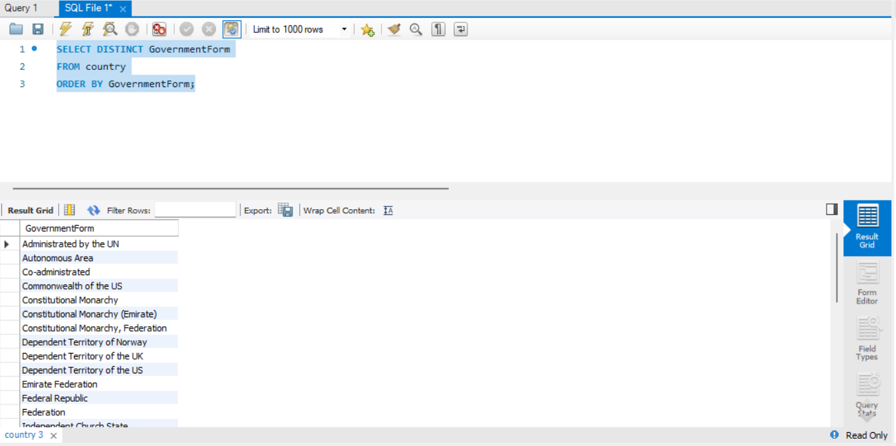
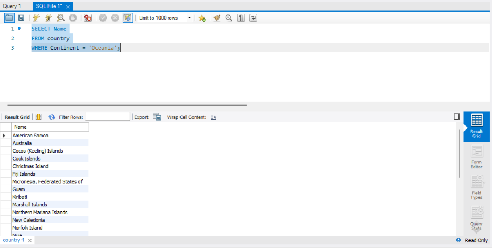
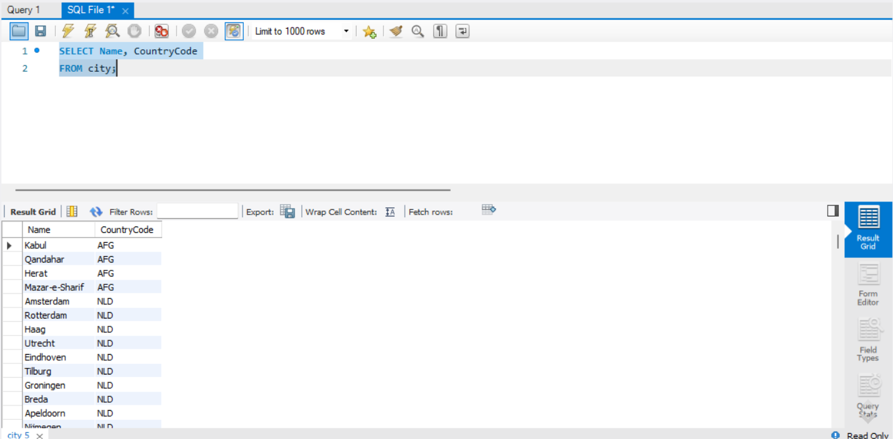
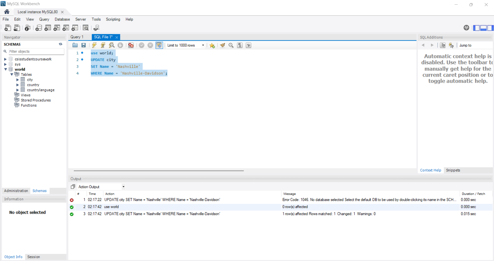
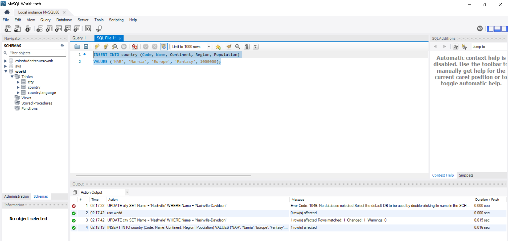
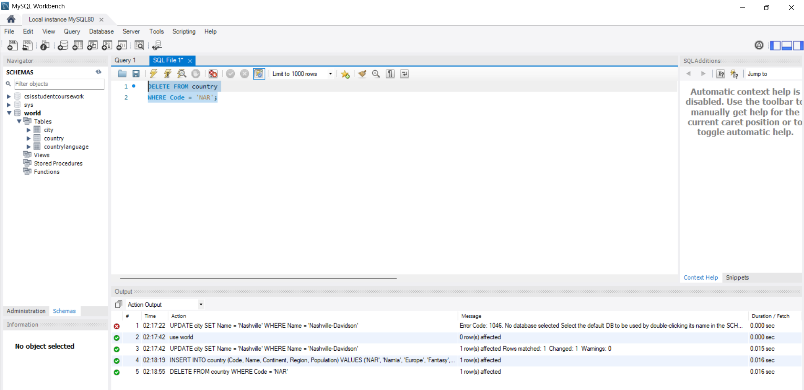

# Exercise 01: World Database SQL Practice

- Name:Karto
- Course: Database for Analytics
- Module: 1
- Database Used: World Database

---

## Instructions

- Answer each question below.
- All SQL commands **must be executed** against the World database.
- For each SQL command:
  - Include the SQL in a fenced code block
  - Include a **screenshot** showing the command and results
- Store screenshots in the `screenshots/` folder and embed them below each answer.

---

## Question 1

**Compare and contrast the data types used for:**
- `country.Population`
- `country.LifeExpectancy`

Why were these data types selected?

### Answer
country.Population is stored as an INT because population values are whole numbers and do not require decimal precision. Using an integer is efficient for storage and calculations such as sums and averages.

country.LifeExpectancy is stored as a DECIMAL(3,1) because life expectancy often includes fractional values (for example, 78.4 years). This data type allows precise storage of decimal values without rounding errors.

### Screenshot
_Show the table structure or DESCRIBE output._

```sql
DESCRIBE country;
```



---

## Question 2

**What is the data type of `country.IndepYear`?**
Why do you think this data type was selected?

### Answer
The data type of country.IndepYear is SMALLINT.
This data type was selected because years fall within a relatively small numeric range and do not require decimal values. SMALLINT uses less storage space than a full integer while still covering historical and modern year values.

### Screenshot

```sql
DESCRIBE country;
```



---

## Question 3

**Make a case for a different data type for `country.IndepYear`.**
Explain why your proposed data type might be better in some situations.

### Answer
An alternative data type for country.IndepYear could be YEAR.
Using the YEAR data type would improve clarity and enforce valid year values, making the column more semantically meaningful. This could be beneficial for date-based queries or when enforcing stricter data validation related to historical timelines.

---

## Question 4

Write a SQL command to **list the names of all cities in alphabetical order**.

### SQL

```sql
SELECT Name
FROM city
ORDER BY Name;
```

### Screenshot



---

## Question 5

Write a SQL command to **list all forms of government from the `country` table**, showing **each only once**, sorted alphabetically.

### SQL

```sql
SELECT DISTINCT GovernmentForm
FROM country
ORDER BY GovernmentForm;
```

### Screenshot



---

## Question 6

Write a SQL command to **list all countries in the `Oceania` continent**.

### SQL

```sql
SELECT Name
FROM country
WHERE Continent = 'Oceania';
```

### Screenshot



---

## Question 7

Write a SQL command to **list the names and country code of all cities**.

### SQL

```sql
SELECT Name, CountryCode
FROM city;
```

### Screenshot



---

## Question 8

Write a SQL command to **update the city named `"Nashville-Davidson"` to `"Nashville"`**.

### SQL

```sql
UPDATE city
SET Name = 'Nashville'
WHERE Name = 'Nashville-Davidson';
```

### Screenshot



---

## Question 9

Write a SQL command to **insert a new country named `"Narnia"`** with a country code of `"NAR"`.
Use reasonable values for the remaining columns.

### SQL

```sql
INSERT INTO country (Code, Name, Continent, Region, Population)
VALUES ('NAR', 'Narnia', 'Europe', 'Fantasy', 1000000);
```

### Screenshot



---

## Question 10

Write a SQL command to **delete the country with the country code `"NAR"`**.

### SQL

```sql
DELETE FROM country
WHERE Code = 'NAR';
```

### Screenshot


