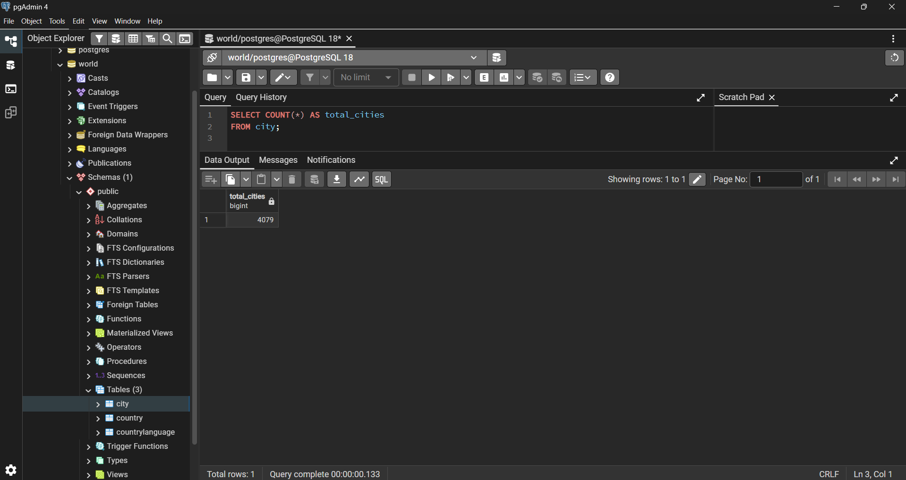
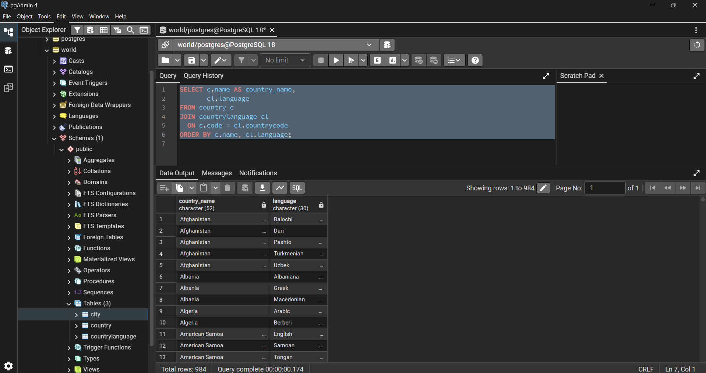
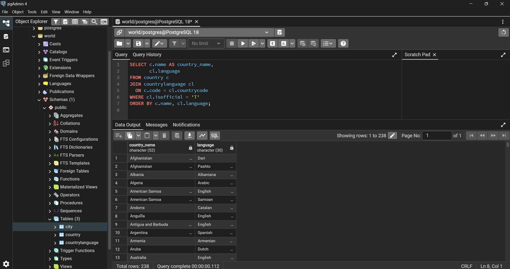
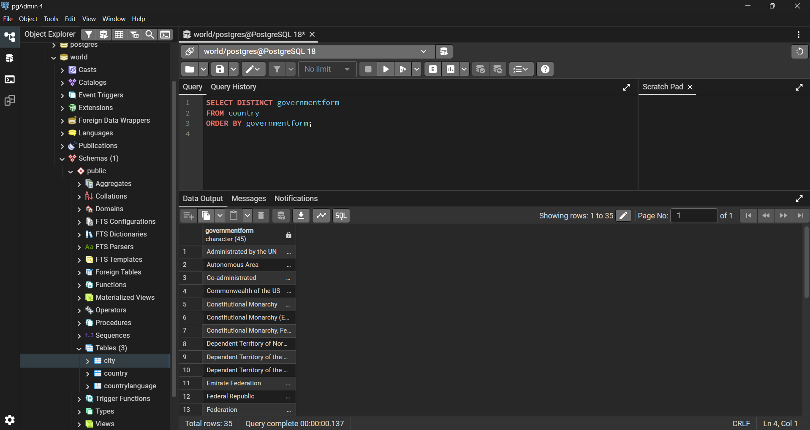
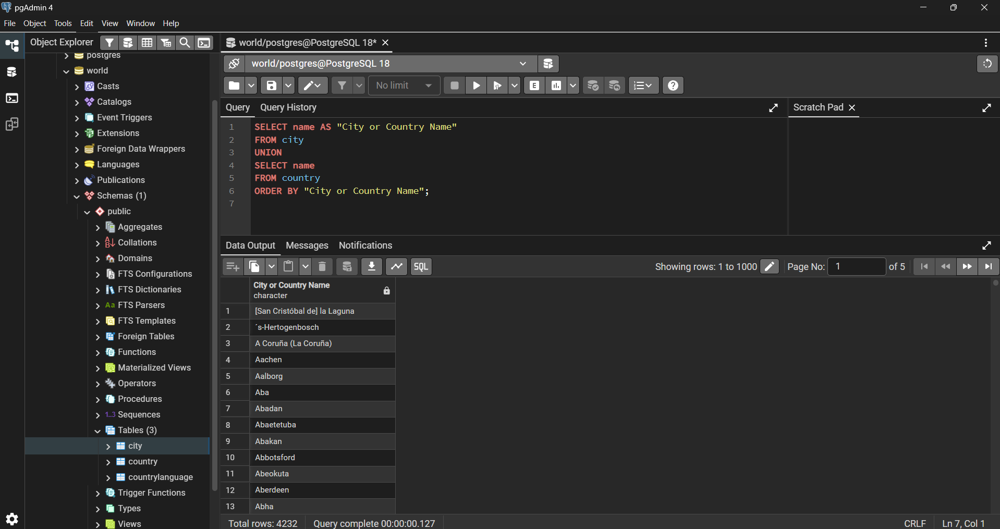
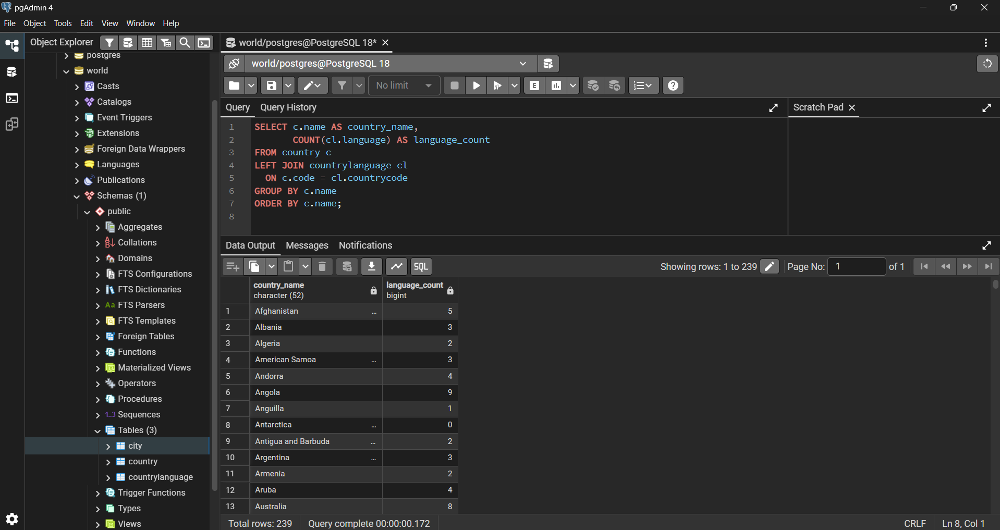
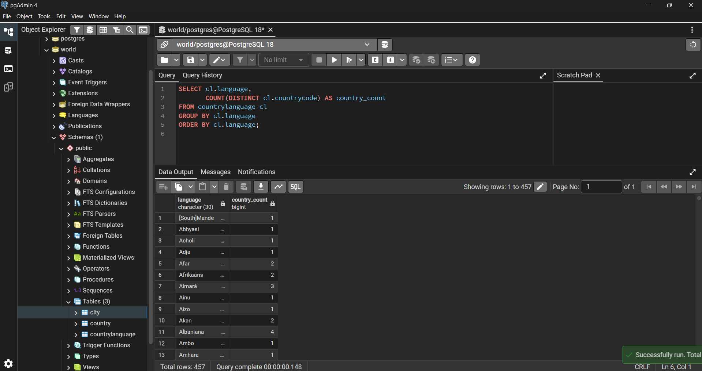
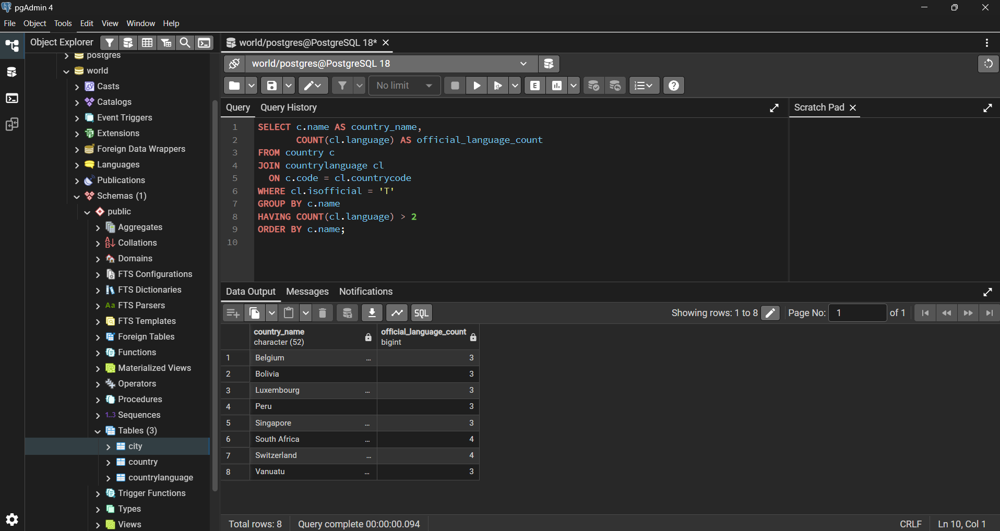
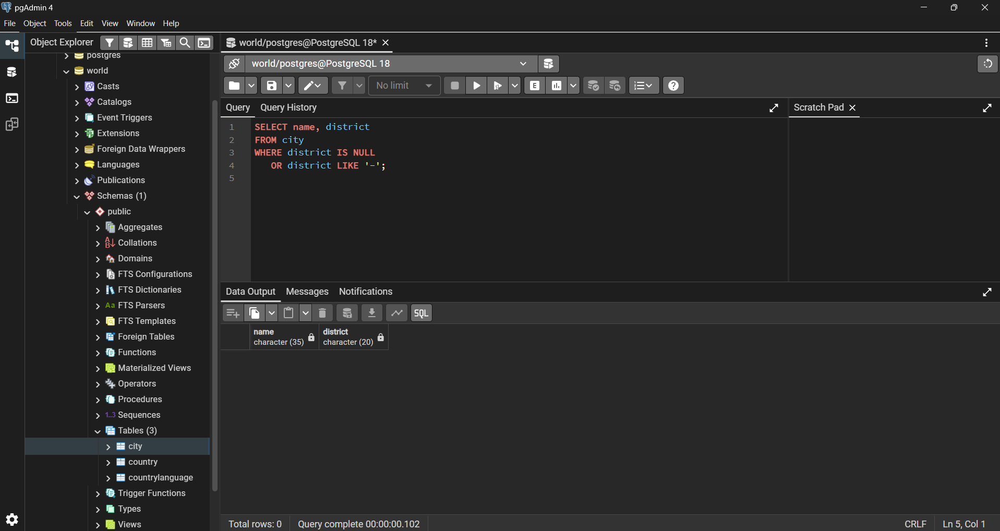
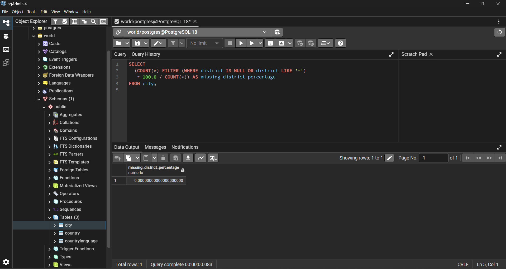

# Exercise 02: World Database – Joins, Grouping, and Data Quality

- Name:Karto
- Course: Database for Analytics
- Module: 2
- Database Used: World Database (PostgreSQL)

---

## Instructions

- Answer each question below using SQL executed against the **World database**.
- All SQL commands **must be run by you**.
- For each SQL-based question:
  - Include the SQL command in a fenced code block
  - Include a **screenshot** showing the command and its results
- Store screenshots in the `screenshots/` folder and embed them below each answer.

---

## Question 1

When importing records from `worldPGSQL.sql`, **how many cities were imported**?

### Answer
4079

### Screenshot
_Show evidence of how you determined this (for example, a COUNT query)._

```sql
SELECT COUNT(*) AS total_cities
FROM city;
```



---

## Question 2

Using the World database, write the SQL command to **display each country name along with the name of each language spoken in that country**.

### SQL

```sql
SELECT c.name AS country_name,
       cl.language
FROM country c
JOIN countrylanguage cl
  ON c.code = cl.countrycode
ORDER BY c.name, cl.language;
```

### Screenshot



---

## Question 3

Using the World database, write the SQL command to **display each country name along with the name of each official language spoken in that country**.

### SQL

```sql
SELECT c.name AS country_name,
       cl.language
FROM country c
JOIN countrylanguage cl
  ON c.code = cl.countrycode
WHERE cl.isofficial = 'T'
ORDER BY c.name, cl.language;
```

### Screenshot



---

## Question 4

Consider the following two SQL statements:

```sql
SELECT *
FROM country, countrylanguage
WHERE country.code = countrylanguage.countrycode;
```

```sql
SELECT *
FROM country
LEFT OUTER JOIN countrylanguage
ON country.code = countrylanguage.countrycode;
```

**In your own words**, describe what data the **second query returns that the first query does not**.

### Answer
The second query (LEFT OUTER JOIN) returns all countries, including those that do not have any matching records in the countrylanguage table. For such countries, the language-related columns are returned as NULL.
The first query only returns countries that have at least one matching language, excluding countries without related records.
---

## Question 5

Using the World database, write the SQL command to **list all different forms of government** found in the data.
Do **not** repeat any form of government more than once.

### SQL

```sql
SELECT DISTINCT governmentform
FROM country
ORDER BY governmentform;
```

### Screenshot



---

## Question 6

Using the World database, write the SQL command to **list all names of cities and countries in one column**.
Label the column **"City or Country Name"**.

### SQL

```sql
SELECT name AS "City or Country Name"
FROM city
UNION
SELECT name
FROM country
ORDER BY "City or Country Name";
```

### Screenshot



---

## Question 7

Using the World database, write the SQL command to **list all countries by name**, along with the **number of languages spoken in each country**.
Be sure to **sort by country name**.

### SQL

```sql
SELECT c.name AS country_name,
       COUNT(cl.language) AS language_count
FROM country c
LEFT JOIN countrylanguage cl
  ON c.code = cl.countrycode
GROUP BY c.name
ORDER BY c.name;
```

### Screenshot



---

## Question 8

Using the World database, write the SQL command to **list all languages**, along with the **number of countries where each language is spoken**.
Be sure to **sort by language name**.

### SQL

```sql
SELECT cl.language,
       COUNT(DISTINCT cl.countrycode) AS country_count
FROM countrylanguage cl
GROUP BY cl.language
ORDER BY cl.language;
```

### Screenshot



---

## Question 9

Using the World database, write the SQL command to **list countries that have more than two official languages**, along with the **number of official languages spoken**.

*Hint: There are 8 such countries in this dataset.*

### SQL

```sql
SELECT c.name AS country_name,
       COUNT(cl.language) AS official_language_count
FROM country c
JOIN countrylanguage cl
  ON c.code = cl.countrycode
WHERE cl.isofficial = 'T'
GROUP BY c.name
HAVING COUNT(cl.language) > 2
ORDER BY c.name;
```

### Screenshot



---

## Question 10

Using the World database, write the SQL command to **find cities where the district value is missing**.

*Hint: Use `LIKE` and the dash (`-`) since some rows use that instead of actual data.*

### SQL

```sql
SELECT name, district
FROM city
WHERE district IS NULL
   OR district LIKE '-';
```

### Screenshot



---

## Question 11

Using the World database, write the SQL command to **calculate the percentage of cities with missing district values**.

*Hint: The result should be approximately 0.4%.*

### SQL

```sql
SELECT
  (COUNT(*) FILTER (WHERE district IS NULL OR district LIKE '-')
   * 100.0 / COUNT(*)) AS missing_district_percentage
FROM city;
```

### Screenshot


